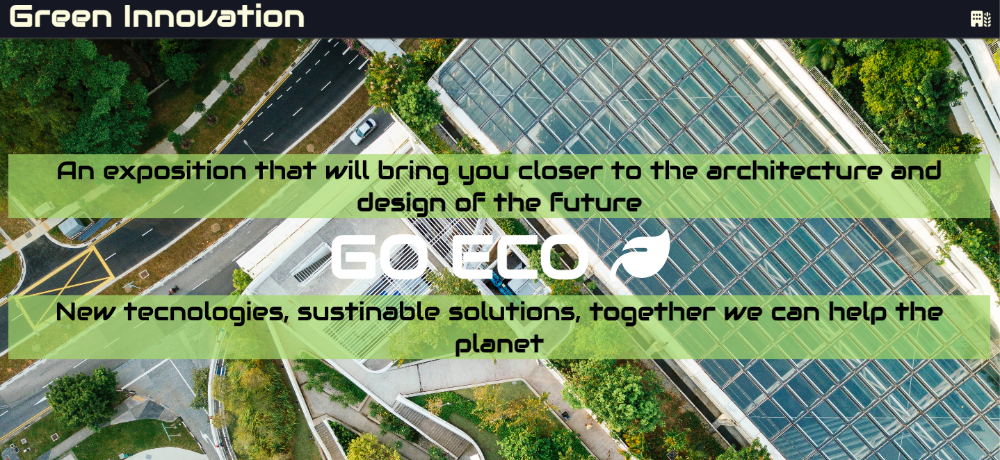
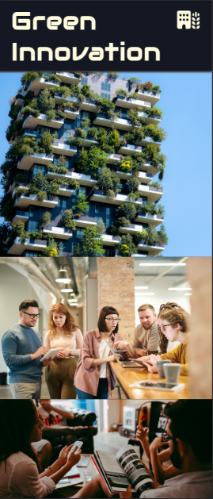

Green Innovation
Exposition and Open house 2023 in Barcelona, Spain.

An event place to share and experience new ideas and projects that architects, engineers and designers are planning for a more sustainable and respectfull future for the world in where the cities are more involve with nature.
Forums, Ted talks, learning, activities and alot of fun.

---

## User Stories

### First time Visitor Goal:

* As a first visitor experience I want to understand what is the page about, being able to relate the content with what I am looking for, navigate esily and see all the information clearly, to get interested in the topics that are proposed and being able to contact for further information about my interest.

### Returning Visitor Goals:

* As a returning visitor, I will be looking more deep information about the event dates, hours and activities. Probably will check in more depth the gallery and images the page is showing me.

### Frequent Visitor Goals:

* As a Frequent visitor, I want to be able to share this information with my comminity, spread the information in an easy, practical and trusthwortypage. Also being able to generate more customers co atend the event.

## Features

### Navbar

#### Navigation

Position: Top of page.
* Contains text logo of the event on the left and on the right one animated icon that dropdown the menu.
* Dropdown menu contain:
- Home
- Info
- Gallery
- Sign-up
* All link have animated hover effect

* The navigation bar in responsive in all screens.

---

### Home Page - Hero Image

* Content:
- The main idea of the event
- Dates and location
- The background acts like a hero image
- Picture of architecture landmark Sagrada Familia
- Show the event on flyer type structure

### Footer

* Footer contains animated social media link that open in a new tab

---

### Info

* Info page have a hero image with a slogan of the event
  
  
* It has two sections that describe the exact location, hours, dates and activites that will occur, with second section explaing what to expect of the event
  

### Gallery

* Gallery page is composed by a title introducing the exposition
* Responsive gallery showing images that describe the exposition

---
### Sign-up

* The Sign-up page have a submition form that is responsive:
* All inputs are set to be required
* Text input are styles
* A blur background
* Animated Icon before the title

-Two checkbox to decide if you want to assist to the expo or want go and also subscribe to a newsletter.

---
### Response

* The Response page appears after submitting the form to show that the information was delivered.
  

---  
## Design

### Wireframe

- The design of the was to create a practical, easy and visual representation of the exposition.

### Pallete/Colors

---
## Technologies used

- HTML: Foundation.
- CSS: Style and layout.
- Github: Host and deploy the code for the website.
- Codeanywhere: Write and edit the code.
- Wireframe.cc Sketch the basic of the idea.
- Coolors.co: Create Pallete.

---
## Testing

* To confirm page was successfully functioning was teste in 3 diferent browsers: Chrome, Safari and Mozilla Firefox.
  - Chrome: 
    
  - Safari:
    
  - Firefox:
    

---
## Manual Texting

| feature | action | expected result | tested | passed | comments |
| --- | --- | --- | --- | --- | --- |
| Navbar | | | | | |
| Home | Click on the "Home" link | The user is redirected to the main page | Yes | Yes | - |
| Info | Click on the "Info" link | The user is redirected to the Info page | Yes | Yes | - |
| Gallery | Click on the "Gallery" link | The user is redirected to the gallery page | Yes | Yes | - |
| Sing-up | Click on the "Sing-up" link | The user is redirected to the Sing-up page | Yes | Yes | - |
| Footer | | | | | |
| Instagram icon in the footer | Click on the Instagram icon | The user is redirected to the Instagram page | Yes | Yes | - |
| Twitter icon in the footer | Click on the Twitter icon | The user is redirected to the Twitter page | Yes | Yes | - |
| YouTube icon in the footer | Click on the YouTube icon | The user is redirected to the YouTube page | Yes | Yes | - |
| Sign-up page | | | | | |
| First name input | Enter the first name | The first name is entered | Yes | Yes | If user doesn't enter the first name, the error message appears |
| Last name input | Enter the last name | The last name is entered | Yes | Yes | If user doesn't enter the last name, the error message appears |
| Email input | Enter the email | The email is entered | Yes | Yes | If user doesn't enter the email, the error message appears. If user enters not valid email, the error message appears |
|Coming to the event checkbox | Click on the checkbox | The checkbox is checked | Yes | Yes | These checkboxes are required the user need to selct one to submit |
| "Submit" button | Click on the "Submit" button | The user is redirected to the response page | Yes | Yes | - |

---
## Validator testing

### HTML

#### Home page

No errors.

#### Info page

No errors.

#### Gallery page

No errors.

#### Sing-up page

No errors.

#### Response page

No errors.

### CSS

No errors.

one warning in text area with the font imported: Imported style sheets are not checked in direct input and file upload modes.

### Lighthouse

### Bugs

- Background image was not fitting resposive because of the size of the image.
*Solution* First compress the image, still big but I can work on it using flexbox.

- Nav Bar was not the proper size in large screens
*solution* Easy solution, ajusting the padding in the media query I needed them to be bigger.

### Unsolved Bugs

- None

---
## Deployment

- The project was deployed to GitHub pages. 

- The link can be found [here](https://juandavidc08.github.io/green-innovation-expo/index.html)

## Future improvements

- Add some personal created images that shows more specific the expo image
- Improve the performace on lighthouse

---

## Credits

### Content

- Flexbox videos by Kevin Powell[Link](https://www.youtube.com/@KevinPowell)
- A page that with the reaserch make me feel more creative [Link](https://css-tricks.com/)
- I need to improve them but thismade me really undertand how to do a Readme File (https://github.com/IuliiaKonovalova/animal_shelter)

### Media 

- All images where tken from [Pexels](https://www.pexels.com/es-es/)

- The favicon image was taken from [favicon](https://favicon.io/emoji-favicons/house-with-garden)

- Icons animated and no animated where taken from [FontAwesome] (https://fontawesome.com/)

- Responsive image photo was took from [ui](https://ui.dev/amiresponsive)

---

## Acknowledgments

- [Aleksei Konovalov](https://github.com/lexach91) My mentor that help me to redirect my focus on what is important.
- [Code Institute](https://codeinstitute.net/) tutors and community that help me.
- [Iuliia Konovalova](https://github.com/IuliiaKonovalova/animal_shelter) This ReadMe example is just an excellent study tool, I know there are inprovements in Green Innovation ReadME, but the structure of how its done its completly clear.